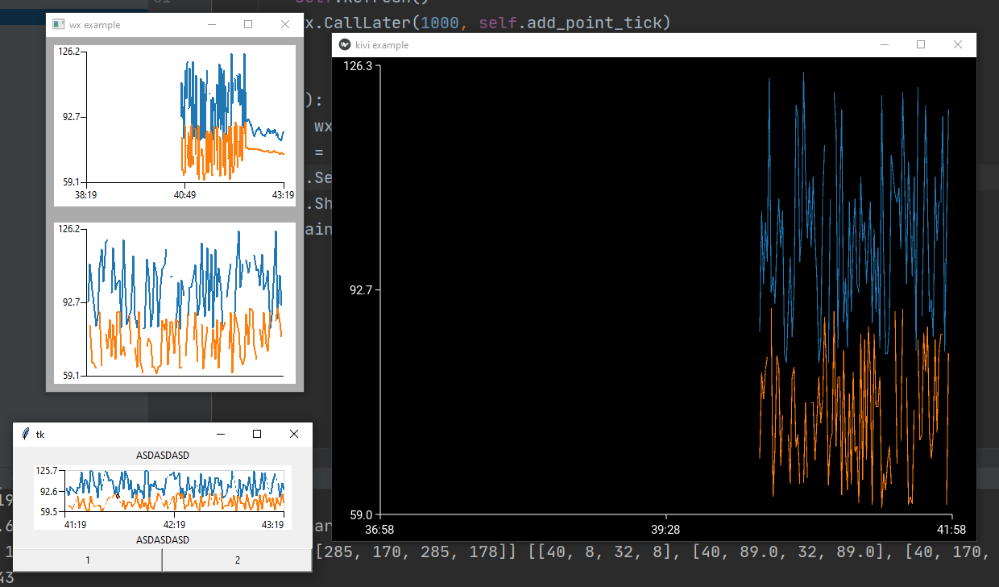

- quick charting engine
- only supports line charts
- various backend implementations(wx/tk/kivy)

```bash 
pip install git+https://github.com/joranbeasley/simplechart.git
```
or
```bash
git clone https://github.com/joranbeasley/simplechart.git
cd simplechart
python setup.py install
```


